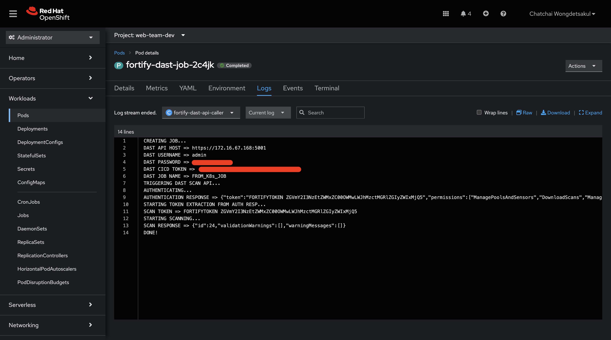
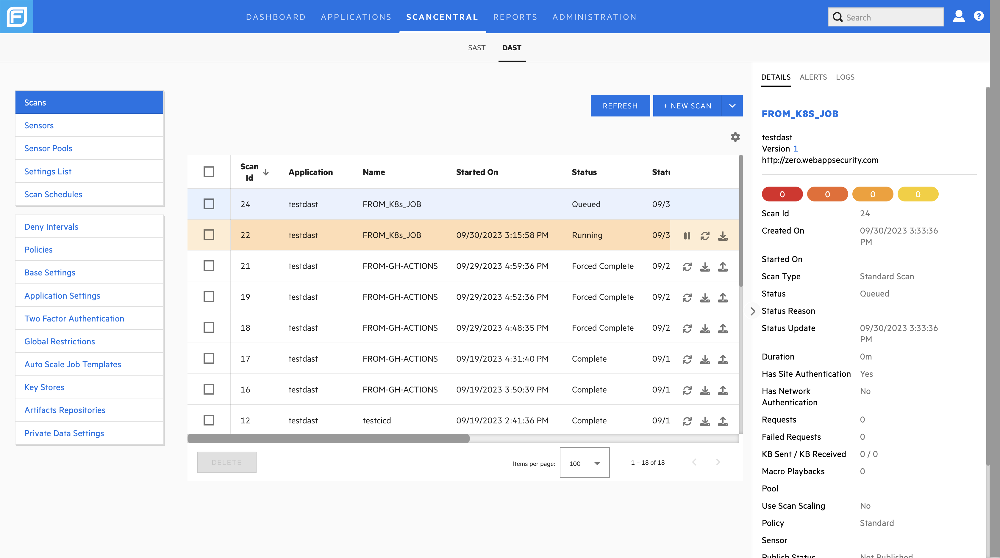

# Fortify DAST API Caller
[](https://github.com/bankierubybank/fortify-dast-api-caller/actions/workflows/main.yml)

This project is for demo how to trigger Fortify DAST scan via K8s job

##### Environment Variable
| Variable name | Description | Default | Mandatory |
| ------ | ------ | ------ | ------ |
| DAST_API_HOST | DAST API HOST | - | YES |
| DAST_USERNAME | DAST USER | - | YES |
| DAST_PASSWORD | DAST PASSWORD | - | YES |
| DAST_CICD_TOKEN | DAST CICD TOKEN | - | YES |
| DAST_JOB_NAME | DAST JOB NAME | - | YES |

### Usage
Docker
```
docker run -e DAST_API_HOST=https://dast.tld -e DAST_USERNAME=admin -e DAST_PASSWORD=P@ssw0rd -e DAST_CICD_TOKEN=xxxxx-xxx-xxx-xxxxx -e DAST_JOB_NAME=TriggerFromDocker -rm bankierubybank/fortify-dast-api-caller:latest
```

K8s/OpenShift
```
kubectl apply -f fortify-dast-job.yml
```



